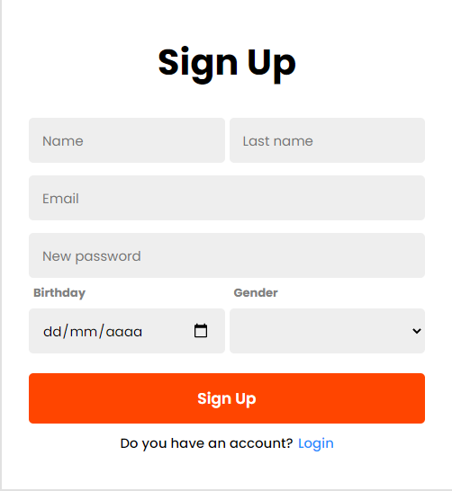

<h1 align="center">
    Formulário de cadastro
</h1>

<h1>
    
</h1>

<h2>Descrição</h2>

Essa é a minha resolução para um exercício que foi proposto no curso de HTML e CSS da B7Web, O desafio era fazer um formulário.

_______________________________________________________________________________________________________________________
<h2>Tecnologias usadas</h2>
<ul>
    <li>HTML5</li>
    <li>CSS3</li>
</ul>